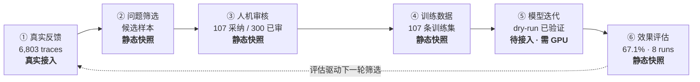
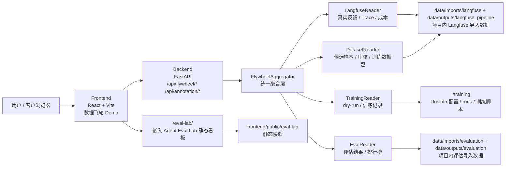
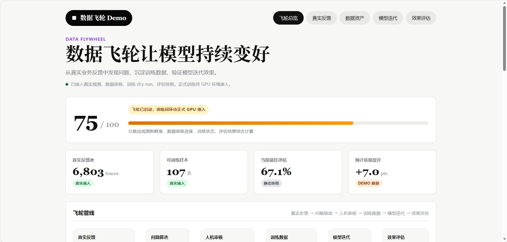
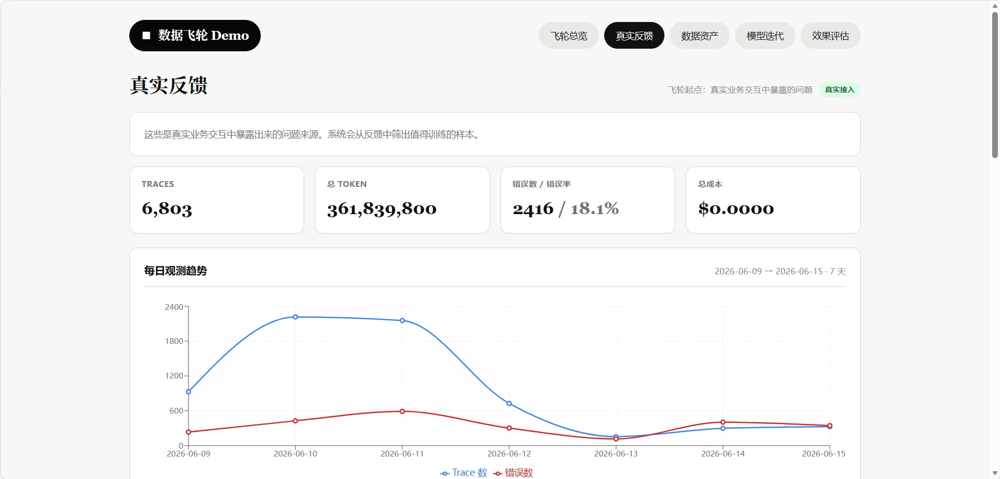
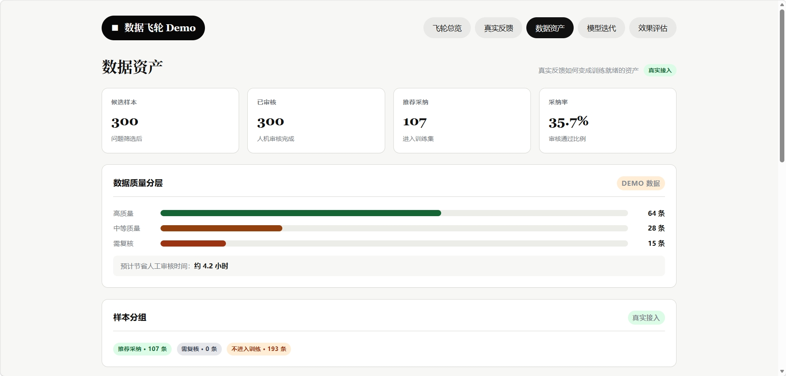
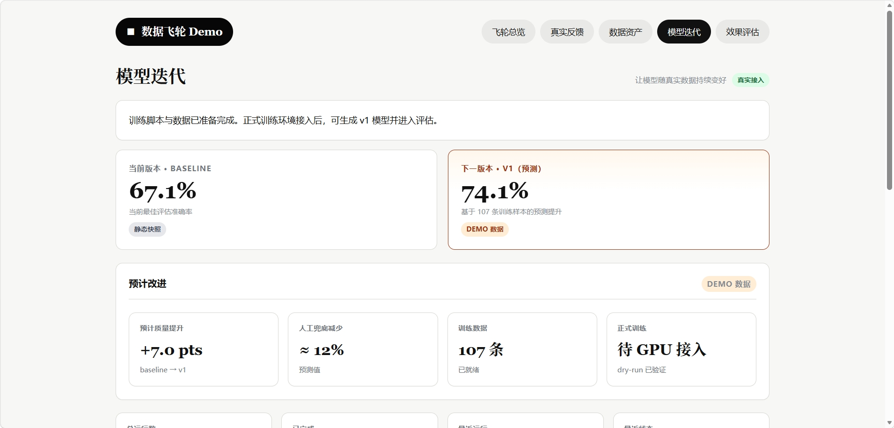
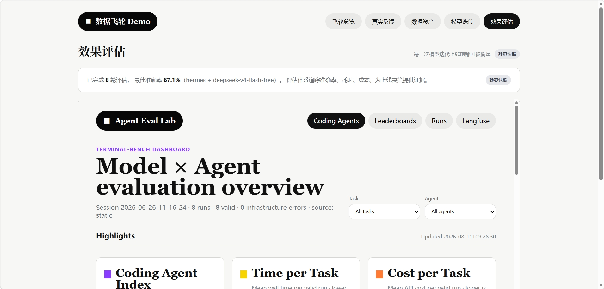

# 数据飞轮 Dashboard

将 Langfuse 数据观测 + 训练数据清洗 + 模型评估 串联成一个闭环可视化产品。

## 产品流程框架

数据飞轮把“生产观测 → 数据资产 → 模型迭代 → 效果评估”串成自驱闭环：真实业务反馈持续进入，经筛选与人工/AI 审核沉淀为训练数据，训练出新模型版本后由评估验证质量，评估结果再驱动下一轮数据筛选。



各阶段当前状态：

| 阶段 | 当前能力 | 数据标签 | 缺口 |
|------|----------|----------|------|
| ① 真实反馈 | 读取 Langfuse 导出 6,803 traces + 趋势 / Top 20 | 真实接入 | 增量 / 实时拉取未接 |
| ② 问题筛选 | 候选样本已产出（300 候选）| 静态快照 | 自动筛选策略未建 |
| ③ 人机审核 | 300 条全审完，AI 批量标注可用 | 静态快照 | 审核标准未与模型质量挂钩 |
| ④ 训练数据 | 107 条训练集已导出 | 静态快照 | — |
| ⑤ 模型迭代 | dry-run 验证通过，未真正训练 | 待接入（需 GPU）| **飞轮最大断点** |
| ⑥ 效果评估 | 项目内评估静态快照（8 runs）| 静态快照 | 非训出模型真实评估，闭环未通 |

> 当前飞轮断点：阶段 ⑤ 需 GPU 才能正式训练；阶段 ⑥ 是静态快照、未闭环到本项目训出的模型。补齐这两项后飞轮才真正自驱。详见文末「产品功能待补齐（研发研判项）」。

## 项目架构



核心链路：

1. `Langfuse` 导出的真实业务反馈先通过导入脚本复制到项目内 `data/imports/langfuse/`，再发布为后端读取的标准输出。
2. 数据管线产出的候选样本进入审核页，审核通过后生成训练数据包。
3. `training/` 记录 dry-run、训练配置和后续正式训练结果。
4. 已导入的评估结果位于项目内 `data/imports/evaluation/` 和 `data/outputs/evaluation/`，再聚合成排行榜和效果指标。
5. 前端用“飞轮总览、真实反馈、数据资产、模型迭代、效果评估”五个页面展示业务闭环。

## 数据导入流程

项目默认读取项目内数据，不再要求运行时直接依赖外部目录。

### 导入 Langfuse 观测与训练数据

```bash
python pipelines/feedback_extraction/import_langfuse.py --source "<langfuse-export-root>"
```

导入后会写入：

| 路径 | 说明 |
|------|------|
| `data/imports/langfuse/` | 保留本次导入的 Langfuse 原始导出、数据管线输出和脚本副本 |
| `data/outputs/langfuse_pipeline/` | 后端默认读取的标准化输出，如 `trace_summary.csv`、`annotation_batch.csv`、`training_dataset.jsonl` |

### 直连 Langfuse API（推荐）

无需外部导出，直接调 Langfuse REST API 拉数据并跑完整管线：

```bash
python pipelines/feedback_extraction/fetch_and_import.py
```

前置配置 `.env`：

```bash
LANGFUSE_HOST=https://agentos.hqzyai.com
LANGFUSE_PUBLIC_KEY=pk-lf-xxx      # Langfuse 项目设置 -> API Keys
LANGFUSE_SECRET_KEY=sk-lf-xxx
LANGFUSE_API_PATH_PREFIX=          # 空 = 标准 /api/public；若反向代理填 /ai-observability
LANGFUSE_FETCH_DAYS=30              # 时间窗口
LANGFUSE_ANNOTATION_BATCH_SIZE=300  # 候选样本数
```

流程：调 `/api/public/observations` 拉数据 → 生成临时 `config.local.json` → 复用 01/02/03 脚本聚合 → 产出 `trace_summary.csv` / `annotation_batch.csv` / `training_dataset.jsonl` → 拷贝到 `data/outputs/langfuse_pipeline/`。

如果 `data/imports/langfuse/langfuse-dataset-pipeline/scripts/` 不存在，会自动从 `data.example` 拷贝脚本副本。命令行参数可覆盖 `.env`：`--host`、`--public-key`、`--secret-key`、`--path-prefix`、`--days`、`--batch-size`。

### 导入评估结果

```bash
python pipelines/evaluation/import_evaluation.py --source "<evaluation-runner-root>"
```

导入后会写入：

| 路径 | 说明 |
|------|------|
| `data/imports/evaluation/results/` | 保留本次导入的评估结果副本 |
| `data/outputs/evaluation/results/` | 后端默认读取的评估结果 |

这套导入脚本也是后续自动导入的预留入口：未来可以由定时任务、后台 job 或页面按钮触发同一套脚本，把最新 Langfuse 观测数据导入项目内标准目录。

## 快速开始

### Docker 启动（推荐）

```bash
docker compose up --build
```

- 前端访问：http://localhost:8080
- 后端 API：http://localhost:8000
- `./data` 与 `./training` 自动挂载到容器，无需额外配置

### 本地开发（可选）

后端：

```bash
cd backend
pip install -r requirements.txt
uvicorn main:app --reload --host 127.0.0.1 --port 8000
```

前端：

```bash
cd frontend
npm install
npm run dev
```

访问 http://localhost:5173

## 数据源配置

默认读取项目内导入数据。通常只需要配置项目内数据根目录和训练目录：

| 变量 | 默认值 | 说明 |
|------|--------|------|
| `FLYWHEEL_DATA_DIR` | `./data` | 项目内导入数据根目录 |
| `LANGFUSE_EXPORT_DIR` | `./data/imports/langfuse/langfuse-export-artifacts` | Langfuse 原始导出目录 |
| `LANGFUSE_PIPELINE_DIR` | `./data/outputs/langfuse_pipeline` | Langfuse 数据管线标准输出 |
| `EVAL_RESULTS_DIR` | `./data/outputs/evaluation/results` | 评估结果目录 |
| `TRAINING_DIR` | `./training` | 训练配置与运行记录 |

## API 端点

| 端点 | 说明 |
|------|------|
| `GET /api/flywheel/summary` | 飞轮总览（价值指标 + 健康度 + 投影 + 洞察） |
| `GET /api/flywheel/pipeline` | 业务化 6 节点管线 + 瓶颈分析 |
| `GET /api/flywheel/events` | 事件时间线 |
| `GET /api/flywheel/evaluations` | 评估结果 + 排行榜 |
| `GET /api/flywheel/observations` | 真实反馈趋势（按天分桶）+ Top trace |
| `GET /api/flywheel/training` | 训练 run 历史 + config.yaml 原文 |

---

## 产品功能待补齐（研发研判项）

> 当前飞轮健康度 **75/100**，状态「飞轮已启动，训练闭环待正式 GPU 接入」。以下按优先级列出待补齐项，供研发评估工作量与技术方案。

### P0 — 闭环断点（不补则飞轮无法自驱）

| # | 待补齐项 | 现状 | 目标 | 研判要点 |
|---|----------|------|------|----------|
| 1 | **正式训练** | 仅 `dry-run`：生成 `train_unsloth.py` + run 记录落账，从未真正训练 | 用 107 条训练集跑通 LoRA / QLoRA 4bit，产出可用 adapter | Unsloth 不支持 Windows 原生 → 需 **WSL2 或云 GPU**；确认 GPU 资源归属、显存规格（27B QLoRA 需 24GB 级）、训练是否安排在业务闲时 |
| 2 | **评估闭环** | 「效果评估」页是项目内评估静态快照（8 runs），非本项目训出模型的评估 | 对训出 adapter 跑项目内评估流程，结果进 `data/outputs/evaluation/results` 后排行榜自动更新 | 需定义评估集与发布门禁（新 adapter 必须优于当前版本才上线）；确认评估 runner 是否需改造以支持 adapter 加载 |

### P1 — 连接性（打通"数据→模型→分数"链路）

| # | 待补齐项 | 现状 | 目标 | 研判要点 |
|---|----------|------|------|----------|
| 3 | **训练 ↔ 评估关联** | 训练页读飞轮 `training/`，评估页读项目内评估静态快照，两侧数据割裂 | 展示「用哪些数据 → 训出什么模型 → 得到什么分数」完整链路 | 需设计 run_id 贯穿的数据契约；训练 run 与评估结果如何建立外键关系 |
| 4 | **模型版本追踪** | 无版本概念，仅 baseline 67.1% + v1 预测值（Demo 数据） | 跨代模型对比（v0/v1/v2…），雷达图多维展示 | 对应生产 **LoRA adapter 版本化热插拔** 设计；需确定 adapter 命名/存储规范与回滚机制 |
| 5 | **预计质量提升去 Demo 化** | `+7.0 pts` 是硬编码投影规则（标 Demo 数据） | 用真实历史迭代数据回归出预测模型，或直接改为实测值 | 需累积 ≥2 轮真实训练-评估数据后才有意义，依赖 P0 完成 |

### P2 — 自动化（当前 importer 仅手动命令）

| # | 待补齐项 | 现状 | 目标 | 研判要点 |
|---|----------|------|------|----------|
| 6 | **自动导入** | 手动跑 `import_langfuse.py` / `import_evaluation.py` | ①后台定时任务 ②页面按钮触发 job ③新增 `POST /api/import/langfuse` + `GET /api/import/jobs/{id}` | 已预留入口；需定 job 队列方案（复用 ai_annotator 的线程池模式？）与并发写冲突处理 |
| 7 | **增量导入** | 每次全量复制（Langfuse 19 files / 评估 54 files） | manifest 记录上次导入时间，按 mtime 或 Langfuse API 游标增量拉取 | 需确认是否直连 Langfuse API（而非依赖导出产物），涉及凭证管理 |
| 8 | **自动飞轮** | 各环节手动串接 | 定时链路：导出 → AI 标注 → 训练 → 评估 → 报告 | 依赖 P0 + P2#6；需设计失败重试、人工卡点（审核环节是否允许全自动） |
| 9 | **数据漂移检测** | 无 | 生产数据分布变化告警，驱动新一轮筛选 | 需定义漂移指标（输入分布 / 错误率 / 成本突变）与告警阈值 |
| 10 | **多租户** | 单 Langfuse 实例 | 支持多个 Langfuse 实例 / 多业务线隔离 | 涉及 config 多 profile 与数据目录隔离设计 |

### 硬约束（研发需遵守）

- 项目默认使用 `data/` 内的导入数据，不依赖机器上的外部目录。
- 复制进项目内 `data/` 的数据属于数据飞轮运行资产；清理只清理项目内 `data/` 与 `pipelines/`，不得反向清理引用目录。
- 前端每个模块必须标注数据来源标签（真实接入 / 静态快照 / Demo 数据 / 待接入），便于对外汇报时区分真实数据与演示占位。


---

## 产品截图

| 飞轮总览 | 真实反馈 |
|:---:|:---:|
|  |  |

| 数据资产 | 模型迭代 |
|:---:|:---:|
|  |  |

| 效果评估 |
|:---:|
|  |
